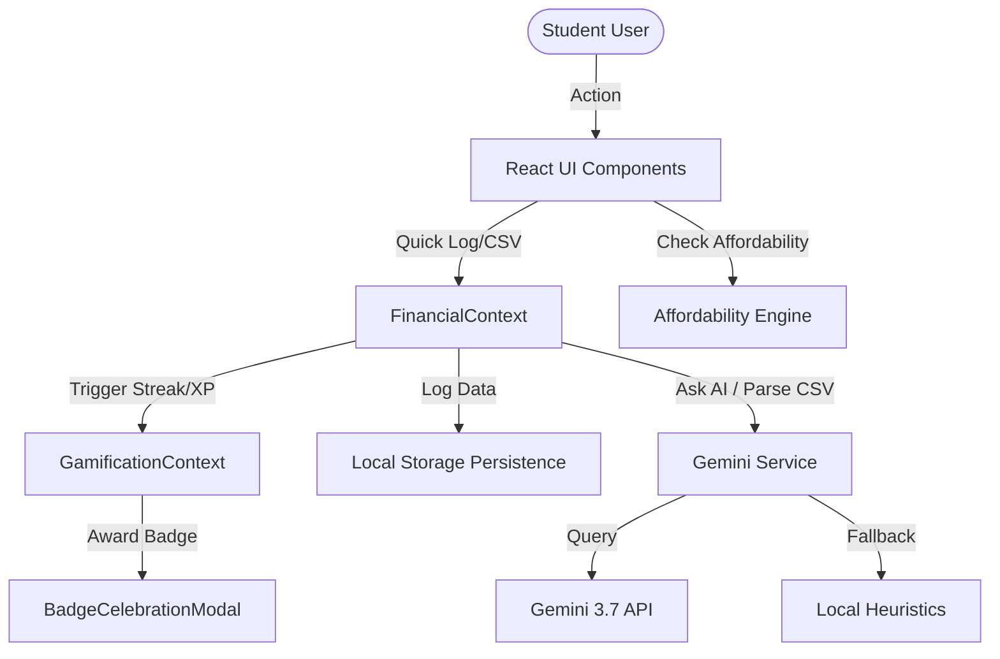

# FinWise — System Architecture (ARCHITECTURE.md)

This document describes the structural layout, folders, data flow, and components of the FinWise React application.

---

## 🛠️ Stack Selection
1. **Frontend Framework:** React 18+ (Vite builder with TypeScript).
2. **Styling:** Tailwind CSS (utility-first, following color tokens in `DESIGN.md`).
3. **Icons:** Lucide React (`lucide-react`).
4. **Charts & Visuals:** Recharts (`recharts`) for area/bar charts and progress gauges.
5. **Animations:** Framer Motion (`motion/react`) for transition hooks and micro-interactions.
6. **Reporting:** `jspdf` and `jspdf-autotable` for client-side monthly report generation.
7. **AI Integration:** Google Gemini API (via `@google/generative-ai` package or direct fetch with fallback heuristic parsers).

---

## 📁 Directory Structure

```text
FinWise/
├── public/                 # Static assets, logos, and global font hooks
├── src/
│   ├── assets/             # Brand logos & static illustrations
│   ├── components/         # Reusable structural widgets
│   │   ├── Navbar.tsx      # Sticky navigation & profile dropdown
│   │   ├── BobChatWidget.tsx # Floating AI assistant panel
│   │   ├── QuickLogFab.tsx # Floating action button for quick logs
│   │   ├── QuickLogModal.tsx # Rapid logging panel with preset chips
│   │   └── BadgeCelebrationModal.tsx # Confetti overlay modal for achievements
│   ├── context/            # Shared React Context providers
│   │   ├── FinancialContext.tsx  # Houses transactions, profile, loans, goals, budgets
│   │   └── GamificationContext.tsx # Houses XP, levels, badges, streaks, logging history
│   ├── pages/              # Tab view containers
│   │   ├── Dashboard.tsx   # Health score, command center, insights, summary cards
│   │   ├── Expenses.tsx    # Transaction list, CSV upload panel, anomaly indicators
│   │   ├── Affordability.tsx # "Can I Afford This?" impulse simulation form & delay cards
│   │   ├── Loans.tsx       # Interest charts, payoff comparisons, Bob's term glossary
│   │   ├── Scholarships.tsx # Scholarship cards, match scores, essay keyword suggestions
│   │   ├── Budget.tsx      # Envelope settings, daily burn rate sliders, savings goals
│   │   └── Habits.tsx      # Streak counts, XP meters, badge grids, heatmap calendar
│   ├── services/           # External API & utility interfaces
│   │   ├── gemini.ts       # Gemini API client wrapper & parsing templates
│   │   ├── csvParser.ts    # Custom text/CSV statement reader
│   │   └── pdfGenerator.ts # PDF statement layout using jspdf-autotable
│   ├── utils/              # Pure functions for calculations
│   │   ├── finance.ts      # EMI calculators, interest schedules, burn rates
│   │   └── health.ts       # Health score aggregate equations
│   ├── App.tsx             # Main routing / tab state controller
│   ├── index.css           # Global custom styles (fonts, backgrounds)
│   └── main.tsx            # DOM initialization entry point
├── .env.example            # Sample configuration for Gemini API keys
├── package.json            # NPM dependencies
└── vite.config.ts          # Vite build config
```

---

## 🔄 Data & State Flow



### 1. Financial Context (`FinancialContext.tsx`)
* Contains user configuration (Major, GPA, Monthly Allowance, Target Savings).
* Manages an array of `Transaction` items, `SavingsGoal` objects, and `StudentLoan` items.
* Exposes utility calculations like `healthScore`, `dailyBurnRate`, `monthlyExpensesByCategory`, and `budgetBurnoutDate`.

### 2. Gamification Context (`GamificationContext.tsx`)
* Tracks logging streak, XP total, and level (1-4).
* Listens to transaction additions and goal achievements to award XP and unlock badges.
* Stores a history grid map of dates logged to populate the habit heatmap calendar.

### 3. Gemini Service (`gemini.ts`)
* Coordinates calls to Gemini 3.7 Flash for category tagging, spending anomaly descriptions, and interactive chatbot feedback.
* Implements a local heuristic fallback if no internet or API key is provided, ensuring uninterrupted offline/demo mode.
