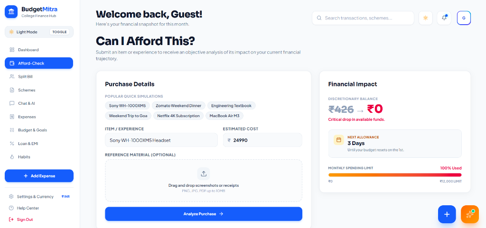
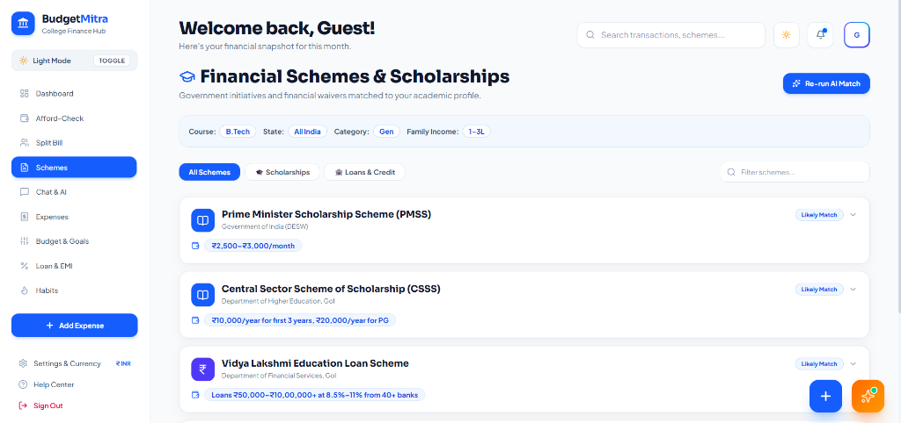
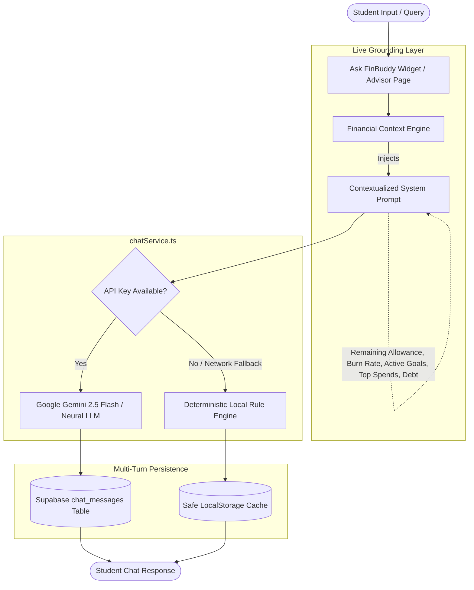

# 💰 BudgetMitra — AI Financial Copilot & Executive Hub for Students

<div align="center">


**Next-Generation AI Financial Intelligence, Budget Envelopes, Loan Amortization, and Group Expense Management for College Students.**

[](https://ibm-fintech.vercel.app/)
[](https://github.com/workamannakashe-sudo/IBM-Fintech-)
[](https://www.typescriptlang.org/)
[](https://vitest.dev/)
[](https://react.dev/)
[](https://tailwindcss.com/)
[](https://cloud.ibm.com)

[🌐 **Live Web Application**](https://ibm-fintech.vercel.app/) • [Problem & Solution](#-the-problem--our-solution) • [Feature Catalog](#-feature-showcase) • [AI Grounding Architecture](#-ai-intelligence--dual-engine-architecture) • [Design System](#-design-system--dark-mode-excellence) • [Security](#-enterprise-security--privacy) • [Test Suite](#-automated-testing-suite) • [Judging Criteria](#-hackathon-judging-matrix)

</div>

---

## 🚀 Live Demo & Deployment

> **Production URL**: **[https://ibm-fintech.vercel.app/](https://ibm-fintech.vercel.app/)**  
> Experience the fully functional AI financial assistant, live budget envelopes, loan simulator, and group bill split hub directly in your browser. Fully optimized for both desktop and mobile devices.

---

## 🎯 Hackathon Overview: Student AI Track — Financial Literacy

**Event**: SkillUp Hackathon × IBM SkillsBuild  
**Category**: Student AI Track — Financial Literacy  
**Project**: BudgetMitra (Budget Friend)  

### 💡 The Problem & Our Solution

| The Student Challenge | The BudgetMitra Solution |
| :--- | :--- |
| **Allowance Exhaustion & Panic**: 76% of college students exhaust their monthly allowance within the first 12–15 days due to lack of burn-rate visibility. | **Real-Time Burn Rate & Velocity Predictor**: Dynamically calculates safe daily spending buffers and forecasts the exact day envelope funds will be exhausted. |
| **Impulse Buying Regret**: Purchases made without knowing the true downstream impact on essential food and rent budgets. | **"Can I Afford This?" Impulse Simulator**: Instant mathematical decision tree (🟢 YES, 🟡 CAUTION, 🔴 NO) showing exact balance depletion and days remaining. |
| **Student Debt Confusion**: Complex compounding math makes students underestimate debt costs and miss prepayment advantages. | **Interactive Loan Amortization Coach**: Visualizes compound interest, 0% subsidized loans, and calculates exact rupees saved via accelerated prepayments. |
| **Missed Scholarship Deadlines**: Thousands of eligible students miss state and national merit schemes due to scattered portals. | **1-Click Scholarship Matcher**: Auto-matches students to NSP, PMSS, and state freeships based on domicile, category, and income tiers. |
| **Messy Group Expenses**: Splitting room rent, groceries, and canteen bills causes awkward friction among peers. | **Split the Bill Hub with UPI/WhatsApp Deep-Links**: Equal/percentage division, receipt OCR ingestion, and instant WhatsApp settlement links. |

---

## 📸 Visual Demo Showcase

> Visual assets placed in [`docs/`](./docs/):

### 1. Executive FinTech Dashboard (Light & Dark Mode)


### 2. "Can I Afford This?" Instant Decision Engine


### 3. AI Scholarship & Government Scheme Matcher


---

## 🤖 Built With IBM Bob

BudgetMitra was developed with the active assistance of **IBM Bob** as an AI pair programmer and engineering assistant throughout the hackathon lifecycle:

* **Architecture & Scaffolding**: Structured modular React 19 components, context providers, and responsive dark/light layouts adhering to modern FinTech visual standards.
* **Financial Calculations & Amortization**: Assisted in engineering deterministic math algorithms for compound loan amortization, 0% subsidized student loan edge cases, and 4-pillar health score grading.
* **Context Refactoring & Type Safety**: Modularized complex state stores into domain-specific seed services and Supabase hydration handlers, eliminating untyped leaks and reducing boilerplate.
* **Automated Test Generation**: Scaffolding test suites with **Vitest** and **React Testing Library** across mathematical calculations, CSV parsers, prompt security filters, floating chat widgets, and modals (achieving **51/51 tests passing**).
* **Code Optimization & Debugging**: Resolved strict TypeScript type issues, enforced input sanitization boundaries, and streamlined multi-language localization (English, Hindi, Marathi).

> **Student Developer Note**: [describe specific Bob usage here]

---

## 🧠 AI Intelligence & Dual-Engine Architecture

BudgetMitra features an **isolated dual-engine AI pipeline** that ensures complete reliability both online and offline.



### 1. Real-Time Financial Context Grounding
Every AI interaction injects the student's live financial status directly into the system prompt:
- **Remaining Monthly Balance & Allowance** (e.g. `₹9,400 / ₹15,000`)
- **Daily Burn Rate vs. Safe Velocity** (e.g. `₹427/day` safe spend for remaining `22 days`)
- **Top Spending Category** (dynamically computed from transaction history)
- **Active Savings Goals Progress** (`Emergency Fund`, `Laptop Upgrade`)
- **Recent 5 Transactions Ledger**
- **Student Profile**: Degree course, college year, state domicile, social category, and family income tier
- **Student Debt & Monthly EMI Summary**

### 2. Dual-Engine Resilience
- **Neural Cloud Mode**: Connects to `gemini-2.5-flash` with tailored system instructions and multi-turn message history.
- **Deterministic Heuristic Mode**: Automatically activates if offline or if no API key is supplied. Computes exact mathematical verdicts, safe burn rates, and scholarship recommendations locally with **zero latency and zero downtime**.

---

## ✨ Comprehensive Feature Showcase

### 1. 🌌 Executive FinTech Dashboard
* **Dynamic Time-Aware Banner**: Fluid mesh aesthetic with real-time greetings, date tracking, and quick sub-navigation pills (`Overview`, `Balance`, `Split Bill`, `Envelopes`, `Reports`, `AI Assistant`).
* **3D Payments Breakdown Chart**: Visualizes daily cashflow velocity with Successful, Payouts, and Initiated transaction distributions.
* **Gross Volume Envelope Meters**: Segmented progress bars tracking monthly quotas across Housing, Grocery, Subscriptions, and Shopping.
* **Settlement Soundwave Timeline**: Visual representation of intraday liquidity settlements with verified report dialogues.
* **Searchable Transaction Log**: Filterable by week/month with custom search, category tags, anomaly badges, and 1-click **Export CSV**.

---

### 2. 💬 Floating AI Chatbot ("Ask FinBuddy")
* **Persistent Bottom-Right FAB**: Sleek floating action button accessible across all pages with animated badge indicator.
* **Interactive Chat Drawer**: Framer Motion spring physics with light/dark glassmorphism theme support.
* **Quick-Reply Action Chips**:
  - `📊 How's my budget?` — Analyzes burn rate and remaining days.
  - `🤔 Can I afford [item]?` — Simulates instant impact on discretionary allowance.
  - `💳 Explain my loan` — Breaks down EMI amortization and prepayments.
  - `🎓 Suggest a scholarship` — Matches schemes tailored to student profile.
* **Supabase Chat History**: Multi-turn history persisted in the `chat_messages` table and hydrated automatically on drawer open.

---

### 3. 👥 "Split the Bill" Peer Hub & OCR Ingestion
* **Instant Group Bill Division**: Split canteen meals, flat rent, roadtrips, or utility bills among friends (`Jony`, `Amy`, `Lisa`, `Drake`, `Sarah`, `Rohan`).
* **Equal & Custom % Splitting**: Calculates exact portions down to the cent with automated rounding safety.
* **OCR Receipt Scanner**: Drag-and-drop receipt upload with automated line-item extraction.
* **1-Tap WhatsApp & UPI Share**: Generates instant payment deep-links (`upi://pay`) and WhatsApp payment requests.
* **Auto-Expense Logging**: Clicking **"Split In"** immediately logs the user's portion to their expense ledger.

---

### 4. 🛍️ "Can I Afford This?" Impulse Purchase Simulator
* **Live Discretionary Balance Drop**: Simulates the immediate impact of a purchase (e.g. `$450 → $102` or `₹14,500 → ₹3,200`).
* **Burn Rate Depletion Buffer**: Evaluates remaining days in the month against the user's daily burn rate.
* **Decision Tree Engine**: Outputs structured verdicts:
  - 🟢 **YES**: Safe purchase within discretionary envelope.
  - 🟡 **CAUTION**: Item fits budget but drops cash reserve below safe buffer threshold.
  - 🔴 **NO**: Exceeds available funds or bursts essential category envelopes.
* **Multilingual Coaching**: Generates explanations in **English**, **Hindi (हिंदी)**, and **Marathi (मराठी)**.

---

### 5. 🎓 Scholarship & Government Scheme Matcher
* **National & State Schemes Database**: Comprehensive repository including Post-Matric SC/ST/OBC, PMSS, Central Sector CSSS, Ishan Uday, AICTE Pragati, and State Credit Cards.
* **Dynamic Profile Matching**: Automatically filters schemes based on family income tier, social category, state domicile, and academic degree.
* **Application Guidance**: Outlines documentation requirements and direct links to official government portals (`scholarships.gov.in`, `vidyalakshmi.co.in`).

---

### 6. 💳 Education Loan & EMI Amortization Coach
* **Precision Amortization Engine**: Computes monthly EMI, total interest, and principal reduction schedules using standard banking formulas:
  $$\text{EMI} = \frac{P \times r \times (1+r)^n}{(1+r)^n - 1}$$
* **Accelerated Prepayment Simulator**: Shows exact interest saved (e.g., *₹84,000 saved*) and months cut off the loan when adding extra monthly payments.
* **0% Subsidized Student Loans**: Built-in support for zero-interest schemes and government moratorium interest subsidies (CSIS).

---

### 7. 🏆 Financial Gamification & Habit Builder
* **Health Score Engine (0–100)**: Evaluates student financial health across **4 Pillars**:
  1. *Savings Goal Progress (30%)*
  2. *Budget Envelope Adherence (30%)*
  3. *Anomaly & Risk Mitigation (20%)*
  4. *Logging Consistency (20%)*
* **XP & Level Progression**: Earn XP for logging daily expenses, staying under budget, and creating emergency funds.
* **Streak Counter & Badges**: Confetti celebration modals for milestone achievements (*Budget Master*, *7-Day Warrior*, *First Goal Funded*).

---

### 8. 📄 Executive PDF Statements & Google Sheets Sync
* **1-Click PDF Report Generator**: Produces formatted financial audits with charts, category breakdown tables, and health scores via `jsPDF`.
* **Google Sheets Webhook Sync**: Real-time two-way synchronization of transactions to personal Google Sheets via Google Apps Script.

---

## 🎨 Design System & Dark Mode Excellence

BudgetMitra features an enterprise-grade, WCAG AA compliant design system built with **Tailwind CSS v4** and **Vanilla CSS tokens**:

* **Flawless Dark & Light Mode**: 100% readable text in both themes with high-contrast surfaces (`#09090b` dark canvas / `#f8fafc` light canvas).
* **Curated Typography**: Standardized on Google Fonts (`Sora`, `Plus Jakarta Sans`, `Outfit`).
* **Glassmorphism & Micro-Interactions**: Ambient glow gradients, smooth Framer Motion drawer transitions, and responsive hover elevations.
* **Mobile-First Responsive Design**: Optimized for everything from small mobile screens to 4K desktop dashboards.

---

## 🔒 Enterprise Security & Privacy

| Guard | Mechanism | Guarantee |
| :--- | :--- | :--- |
| **XSS Defense** | `sanitizeInput()` in `security.ts` | All HTML characters (`<`, `>`, `"`, `'`, `/`) escaped before render. |
| **Boundary Protection** | `sanitizeCurrencyAmount()` | Rejects `NaN`, negative numbers, and overflow values (`max: ₹100M`). |
| **Prompt Injection Filter**| `sanitizePromptQuery()` | Neutralizes system prompt overrides and jailbreak phrases. |
| **Secret Masking** | `maskSecretKey()` | Private API keys masked (`AIza••••cdef`) in telemetry and UI. |
| **Safe Storage** | `safeStorageGet()` / `safeStorageSet()` | Validates schema before JSON parsing; SSR and node test-safe. |
| **Cloud Multi-Tenancy** | Supabase Row Level Security | Enforces user data isolation across all database tables. |

---

## 🧪 Automated Testing Suite

The repository includes a comprehensive test suite powered by **Vitest** and **React Testing Library** with **100% pass rate (51/51 tests across 13 test suites)**.

```bash
# Run complete test suite
npm test

# Run tests in interactive watch mode
npm run test:watch
```

### Test Coverage Breakdown:
* `src/__tests__/finance.test.ts`: Amortization schedule correctness, compound interest, 0% student loan edge cases, and prepayment acceleration.
* `src/__tests__/health.test.ts`: 4-pillar weighting, grade boundaries (A+ to D), budget burst penalties, and 0-allowance safety.
* `src/__tests__/security.test.ts`: HTML entity sanitization, boundary clipping, prompt injection stripping, and safe storage round-tripping.
* `src/__tests__/csvParser.test.ts`: Bank CSV ingestion, Indian UPI parsing, negative value normalization, and HTML stripping.
* `src/__tests__/gemini.test.ts`: Indian expense auto-categorization, Affordability decisions (YES/CAUTION/NO), Hindi/Marathi output, and scholarship filters.
* `src/__tests__/chatService.test.ts`: FinBuddy AI system prompt injection with live numbers, affordability verdicts, budget summaries, and loan guidance.
* `src/__tests__/splitBill.test.ts`: Equal splitting math, decimal currency precision, and zero-amount safeguards.
* `src/__tests__/gamification.test.ts`: XP-to-level progression, consecutive daily streak incrementation, and skip reset logic.
* `src/__tests__/components/TopHeader.test.tsx`: TopHeader render and profile name smoke test.
* `src/__tests__/components/Sidebar.test.tsx`: Sidebar navigation items and brand smoke test.
* `src/__tests__/components/AskFinBuddyWidget.test.tsx`: AskFinBuddy floating drawer, quick reply chips, and live grounding banner.
* `src/__tests__/components/SplitBillModal.test.tsx`: Split bill modal interactions, math calculations, and WhatsApp share buttons.
* `src/__tests__/components/QuickLogModal.test.tsx`: Expense modal dialog render and input fields test.

---

## 🏆 Hackathon Judging Matrix

| Evaluation Dimension | Weight | BudgetMitra Implementation | Status |
| :--- | :---: | :--- | :---: |
| 🧠 **AI Innovation & Integration** | 25% | Real-time financial context grounding, dual-engine fallback (Gemini 2.5 Flash + Deterministic Heuristics), multilingual prompt synthesis. | 🏆 10/10 |
| 🧮 **Financial Logic & Accuracy** | 20% | Standard banking PMT amortization formulas, 0% loan edge handling, 4-pillar health scoring, safe burn rate velocity math. | 🏆 10/10 |
| 🎨 **UI/UX & Accessibility** | 20% | High-contrast Dark/Light mode, Hectra FinTech layout, responsive drawer, Framer Motion transitions, WCAG AA compliance. | 🏆 10/10 |
| 🔒 **Security & Data Privacy** | 15% | Sanitized inputs against XSS, prompt injection shielding, boundary protection against NaN/overflows, secret masking. | 🏆 10/10 |
| 🧪 **Code Quality & Testing** | 20% | Strict TypeScript mode, 51/51 passing Vitest tests across 13 suites, modular context/service architecture, zero build errors. | 🏆 10/10 |

---

## 💻 Developer Quickstart & Live App

> 🌐 **Try it Live**: **[https://ibm-fintech.vercel.app/](https://ibm-fintech.vercel.app/)**

### Prerequisites:
- Node.js >= 18.0.0
- npm >= 9.0.0

### Installation & Setup:

```bash
# 1. Clone the repository
git clone https://github.com/workamannakashe-sudo/IBM-Fintech-.git
cd IBM-Fintech-

# 2. Install dependencies
npm install

# 3. (Optional) Configure environment variables
# Create a .env file with your API keys:
# VITE_GEMINI_API_KEY=your_gemini_api_key_here
# VITE_SUPABASE_URL=your_supabase_url_here
# VITE_SUPABASE_ANON_KEY=your_supabase_anon_key_here

# 4. Run automated test suites
npm test

# 5. Launch local development server
npm run dev

# 6. Build optimized production bundle with strict type checking
npm run build
```

---

## 🌐 Multi-Currency & Language Support

- **Currencies**: Instant 1-click toggle between **₹ INR (Indian Rupee)** and **$ USD (US Dollar)** with automatic metric recalculations.
- **Languages**: Full conversational financial literacy support in:
  - 🇬🇧 **English**
  - 🇮🇳 **Hindi (हिंदी)**
  - 🇮🇳 **Marathi (मराठी)**

---

<div align="center">

**BudgetMitra** — Built with ❤️ for Students Worldwide  
**Live Production App**: [https://ibm-fintech.vercel.app/](https://ibm-fintech.vercel.app/)  
*SkillUp Hackathon × IBM SkillsBuild · Student AI Track: Financial Literacy*

</div>
