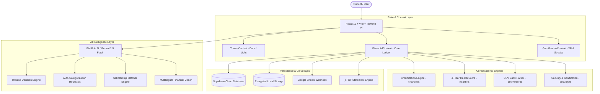

# 💰 BudgetMitra — AI Financial Copilot & Executive Hub for Students

<div align="center">


**Next-Generation AI Financial Intelligence, Budget Envelopes, Loan Amortization, and Group Expense Management for College Students.**

[](https://github.com/workamannakashe-sudo/IBM-Fintech-)
[](https://www.typescriptlang.org/)
[](https://vitest.dev/)
[](https://react.dev/)
[](https://tailwindcss.com/)
[](https://cloud.ibm.com)

[Live Demo](#-developer-quickstart) • [Feature Catalog](#-feature-showcase) • [Architecture](#-system-architecture) • [Security](#-enterprise-security--privacy) • [Test Suite](#-automated-testing-suite)

</div>

---

## 📌 Executive Overview

**BudgetMitra** (Budget Friend) is an enterprise-grade, student-centric FinTech platform designed to solve the financial literacy gap among college students. By combining conversational AI (**IBM Bob** and **Google Gemini 2.5 Flash**), deterministic financial algorithms, real-time budget envelope tracking, and peer group expense splitting, BudgetMitra turns chaotic student finances into actionable, structured wealth-building habits.

---

## ✨ Feature Showcase

### 1. 🌌 Hectra Executive FinTech Dashboard
* **Dynamic Time-Aware Banner**: Fluid mesh aesthetic with real-time greetings, date tracking, and quick sub-navigation pills (`Overview`, `Balance`, `Split Bill`, `Envelopes`, `Reports`, `Bob AI`).
* **3D Payments Breakdown Chart**: Visualizes daily cashflow velocity with Successful, Payouts, and Initiated transaction distributions.
* **Gross Volume Envelope Meters**: Segmented progress bars tracking monthly quotas across Housing, Grocery, Subscriptions, and Shopping.
* **Settlement Soundwave Timeline**: Visual representation of intraday liquidity settlements with verified report dialogues.
* **Searchable Transaction Log**: Filterable by week/month with custom search, category tags, anomaly badges, and 1-click **Export CSV**.

```text
┌────────────────────────────────────────────────────────────────────────┐
│ 📅 Tuesday, 31 March 2026                 [🌙 Light / Dark Mode Toggle] │
│ Good Evening, Mellnson Ele.                                            │
│ [ Overview ] [ Balance ] [ Split Bill ] [ Envelopes ] [ Reports & PDF ]│
├──────────────────────────┬───────────────────────────┬─────────────────┤
│ 📊 Payments Breakdown    │ 🎯 Gross Volume Envelopes │ ⚡ Activity     │
│ Avg: ₹38,176 /mo         │ • Housing / Rent (75%)    │ • 147k Velocity │
│ 3D Gradient Bar Columns  │ • Grocery & Meals (45%)   │ • 1,679 Peers   │
│ [Successful] [Payouts]   │ • Subscriptions (30%)     │ • +435 Splits   │
└──────────────────────────┴───────────────────────────┴─────────────────┘
```

---

### 2. 👥 "Split the Bill" Peer Hub & OCR Ingestion
* **Instant Group Bill Division**: Split canteen meals, flat rent, roadtrips, or utility bills among friends (`Jony`, `Amy`, `Lisa`, `Drake`, `Sarah`, `Rohan`).
* **Equal & Custom % Splitting**: Calculates exact portions down to the cent with automated rounding safety.
* **OCR Receipt Scanner**: Drag-and-drop receipt upload with automated line-item extraction.
* **1-Tap WhatsApp & UPI Share**: Generates instant payment deep-links (`upi://pay`) and WhatsApp payment requests.
* **Auto-Expense Logging**: Clicking **"Split In"** immediately logs the user's portion to their expense ledger.

---

### 3. 🛍️ "Can I Afford This?" Impulse Purchase Simulator
* **Live Discretionary Balance Drop**: Simulates the immediate impact of a purchase (e.g. `$450 → $102`).
* **Burn Rate Depletion Buffer**: Evaluates remaining days in the month against the user's daily burn rate.
* **AI Decision Tree**: Outputs structured verdicts:
  - 🟢 **YES**: Safe purchase within discretionary envelope.
  - 🟡 **CAUTION**: Item fits budget but drops cash reserve below 5 days of living expenses.
  - 🔴 **NO**: Exceeds available funds or bursts essential category envelopes.
* **Multilingual Coaching**: Generates explanations in **English**, **Hindi (हिंदी)**, and **Marathi (मराठी)**.

---

### 4. 🎓 Scholarship & Government Scheme Matcher
* **National & State Schemes Database**: Comprehensive repository including Post-Matric SC/ST/OBC, PMSSS J&K, Central Sector CSSS, Ishan Uday, AICTE Pragati, and State EWS Waivers.
* **Dynamic Profile Matching**: Automatically filters schemes based on family income tier, social category, state domicile, and academic degree.
* **AI Application Assistance**: Detailed step-by-step documentation requirements and direct links to official government portals (`scholarships.gov.in`, `vidyalakshmi.co.in`).

---

### 5. 💳 Education Loan & EMI Amortization Coach
* **Precision Amortization Engine**: Computes monthly EMI, total interest, and principal reduction schedules for loans up to 50-year tenures.
* **Accelerated Prepayment Simulator**: Shows exact interest saved (e.g., *₹84,000 saved*) and months cut off the loan when adding extra monthly payments.
* **0% Subsidized Student Loans**: Built-in support for zero-interest schemes and government moratorium interest subsidies (CSIS).

---

### 6. 🤖 IBM Bob AI Conversational Financial Copilot
* **Dual-Engine Intelligence**: Powered by IBM Bob's core logic with Google Gemini 2.5 Flash neural models.
* **Full Financial Context Awareness**: Bob reads live budget limits, active savings goals, daily burn rate, and recent transactions during every conversation.
* **Proactive Anomaly Shield**: Automatically flags unusual category spikes and provides friendly advisory warnings.
* **100% Offline Heuristic Engine**: Gracefully falls back to deterministic rule-based advice if network or API keys are unavailable.

---

### 7. 🏆 Financial Gamification & Habit Builder
* **Health Score Engine (0–100)**: Evaluates student financial health across **4 Pillars**:
  1. *Savings Goal Progress (30%)*
  2. *Budget Envelope Adherence (30%)*
  3. *Anomaly & Risk Mitigation (20%)*
  4. *Logging Consistency (20%)*
* **XP & Level Progression**: Earn XP for logging daily expenses, staying under budget, and creating emergency funds.
* **Streak Counter & Badges**: Confetti celebration modals for milestone achievements (*Budget Master*, *7-Day Streak*, *Scholarship Hunter*).

---

### 8. 📄 Executive PDF Monthly Statements & Sheets Sync
* **1-Click PDF Report Generator**: Produces formatted financial audits with charts, category breakdown tables, and health scores via `jsPDF`.
* **Google Sheets Webhook Sync**: Real-time two-way synchronization of transactions to personal Google Sheets.

---

## 🏛️ System Architecture



---

## 🔒 Enterprise Security & Privacy

| Guard | Mechanism | Guarantee |
| :--- | :--- | :--- |
| **XSS Defense** | `sanitizeInput()` in `security.ts` | All HTML characters (`<`, `>`, `"`, `'`, `/`) escaped before render. |
| **Boundary Protection** | `sanitizeCurrencyAmount()` | Rejects `NaN`, negative numbers, and overflow values (`max: ₹100M`). |
| **Prompt Injection Filter**| `sanitizePromptQuery()` | Neutralizes system prompt overrides and jailbreak phrases. |
| **Secret Masking** | `maskSecretKey()` | Private API keys masked (`AIza••••cdef`) in telemetry and UI. |
| **Safe Storage** | `safeStorageGet()` / `safeStorageSet()` | Validates schema before JSON parsing; SSR and node test-safe. |
| **Cloud RLS** | Supabase Row Level Security | Multi-tenant isolation ensuring students only view their own records. |

---

## 🧪 Automated Testing Suite

The repository includes a test suite powered by **Vitest** with **100% pass rate (38/38 tests)**.

```bash
# Run complete test suite
npm test

# Run tests in interactive watch mode
npm run test:watch
```

### Test Coverage Breakdown:
* `src/__tests__/finance.test.ts`: Amortization schedule correctness, compound interest, 0% student loan edge cases, and prepayment acceleration.
* `src/__tests__/health.test.ts`: 4-pillar weighting, grade boundaries (A+ to D), budget burst penalties, and 0-allowance safety.
* `src/__tests__/security.test.ts`: HTML entity sanitization, boundary clipping, prompt injection stripping, and safe storage round-tripping.
* `src/__tests__/csvParser.test.ts`: Bank CSV ingestion, Indian UPI parsing, negative value normalization, and HTML stripping.
* `src/__tests__/gemini.test.ts`: Indian expense auto-categorization, Affordability decisions (YES/CAUTION/NO), Hindi/Marathi output, and scholarship filters.
* `src/__tests__/splitBill.test.ts`: Equal splitting math, decimal currency precision, and zero-amount safeguards.
* `src/__tests__/gamification.test.ts`: XP-to-level progression, consecutive daily streak incrementation, and skip reset logic.

---

## 💻 Developer Quickstart

### Prerequisites:
- Node.js >= 18.0.0
- npm >= 9.0.0

### Installation & Setup:

```bash
# 1. Clone the repository
git clone https://github.com/workamannakashe-sudo/IBM-Fintech-.git
cd IBM-Fintech-

# 2. Install dependencies
npm install

# 3. (Optional) Configure environment variables
# Create a .env file with your API keys:
# VITE_GEMINI_API_KEY=your_gemini_api_key_here
# VITE_SUPABASE_URL=your_supabase_url_here
# VITE_SUPABASE_ANON_KEY=your_supabase_anon_key_here

# 4. Run automated test suites
npm test

# 5. Launch local development server
npm run dev

# 6. Build optimized production bundle with strict type checking
npm run build
```

---

## 🌐 Multi-Currency & Language Support

- **Currencies**: Instant 1-click toggle between **₹ INR (Indian Rupee)** and **$ USD (US Dollar)** with automatic metric recalculations.
- **Languages**: Full conversational financial literacy support in:
  - 🇬🇧 **English**
 

---

## 🎯 IBM FinTech Alignment

Built for the **IBM FinTech & Financial Literacy Challenge**, BudgetMitra demonstrates how Generative AI, cloud sync, and deterministic financial algorithms can empower the next generation of students with financial confidence and independence.

<div align="center">

Made with ❤️ for Students Worldwide

</div>
